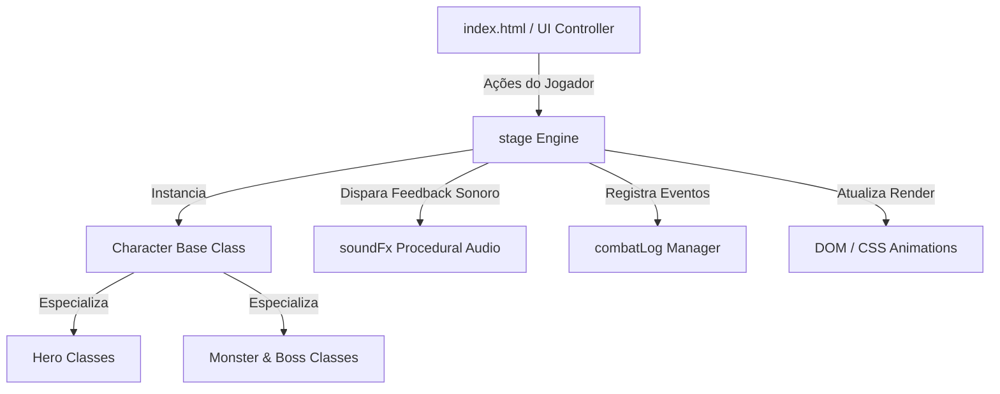

# ⚔️ RPG Battle Arena — Projeto Luta 2.0

> Engine de combate tático por turnos em JavaScript moderno (ES6+), renderização Dark Fantasy imersiva com Glassmorphism e síntese de áudio procedural via Web Audio API.

[](https://developer.mozilla.org/pt-BR/docs/Web/JavaScript)
[](https://developer.mozilla.org/pt-BR/docs/Web/HTML)
[](https://developer.mozilla.org/pt-BR/docs/Web/CSS)
[](https://developer.mozilla.org/en-US/docs/Web/API/Web_Audio_API)
[](#)
[](LICENSE)

---

## 📖 Visão Geral

O **RPG Battle Arena (Projeto Luta 2.0)** é uma aplicação web interativa que simula combates clássicos de RPG de turno com alta fidelidade visual e sonora. O projeto foi desenhado para resolver o problema de latência, peso e fragilidade de assets externos em jogos web: toda a ambientação acústica é gerada proceduralmente através da **Web Audio API** nativa (sem necessidade de arquivos `.mp3` ou `.wav`), e toda a mecânica de combate opera sobre uma arquitetura orientada a objetos desacoplada via **Factory Functions**.

A aplicação conta ainda com um compêndio narrativo completo (*Bestiário & Lore*), integração por parâmetros de URL para geração de partidas temáticas e suporte responsivo a múltiplos dispositivos.

---

## ⚡ Principais Funcionalidades

- **Mecânica Tática por Turnos:** Sistema de combate com cálculo não-linear de dano, mitigação por armadura, taxas variáveis de acerto crítico e esquiva dinâmica (*dodge*).
- **Elenco Balanceado de Campeões (6 Classes):**
  - **Guerreiro Paladino (Viktor):** Tanque com alto valor de armadura e dano demolidor.
  - **Mago Arcano (Viktor):** *Glass cannon* com escalonamento de dano mágico elevado e múltiplas poções.
  - **Arqueira Caçadora (Lyra):** Especialista em combate à distância com a maior taxa de acerto crítico do jogo (32%).
  - **Ladino Assassino (Sombra):** Alta evasão (26% de esquiva) e habilidades com *cooldown* reduzido.
  - **Clérigo Sagrado (Ildor):** Mestre de sustentação com habilidades radiantes e pacote expandido de poções.
  - **Bárbaro Berserker (Krag):** Pontos de vida massivos e multiplicadores devastadores de fúria.
- **Bestiário Variado & Chefões de Duas Fases:**
  - 6 oponentes padrão com rotinas táticas distintas (Goblin Ladrão, Esqueleto Arqueiro, Xamã Goblin, Lobo da Noite, Mímico Devorador e Golem de Lava).
  - 2 Chefões Supremos com mecânicas especiais: **Rei dos Goblins** (bombas de fumaça e fúria) e **Colosso Ancestral** (ataques sísmicos telegrafados com aviso prévio).
- **Áudio Sintetizado 100% Nativo:** Efeitos de corte de lâmina, flechas, magias elementais, rugidos, alertas de boss, poções e fanfarras de vitória sintetizados em tempo real via osciladores senoidais e dente de serra. Zero dependência de rede.
- **Feedback Visual Instantâneo:** Indicadores flutuantes de dano e cura (*Floating Numbers*), tremor de câmera (*Screenshake*), barras de HP interpoladas dinamicamente e registro em tempo real em log cronológico estilizado.
- **Compêndio Narrativo Integrado (`lore.html`):** Enciclopédia com histórias, atributos e botão de *desafio direto* que transporta o jogador para a arena com o confronto pré-selecionado via `URLSearchParams`.

---

## 🛠️ Stack Tecnológica

| Camada | Tecnologia | Propósito no Projeto |
| :--- | :--- | :--- |
| **Linguagem Principal** | `JavaScript (ES6+)` | POO com classes herdeiras, Factory Pattern, controle de estado da FSM e manipulação de DOM |
| **Interface & Estrutura** | `HTML5 Semântico` | Marcação estruturada, acessibilidade (`aria-label`) e divisão por seções semânticas |
| **Estilização & Efeitos** | `CSS3 Moderno` | Glassmorphism, CSS Custom Properties, flexbox/grid, animações via `@keyframes` aceleradas por GPU |
| **Engine de Áudio** | `Web Audio API` | Geração procedural de ondas sonoras, envelopes de amplitude ADSR e modulação de frequência |
| **Tipografia & Ícones** | `Google Fonts` | Famílias *Cinzel* (títulos heróicos) e *Outfit* (interface de dados e legibilidade) |
| **Compatibilidade** | `Padrões Web W3C` | Zero dependências externas de build (executável em qualquer navegador moderno) |

---

## 🏛️ Arquitetura e Padrões de Projeto

A arquitetura do projeto foi estruturada com separação rigorosa de responsabilidades entre regras de negócio, motor de áudio, renderização e ciclo de vida:



### Estrutura de Pastas

```text
PROJETO LUTA 2.0/
├── assets/
│   ├── css/
│   │   ├── style.css         # Design system principal, arena, cards e animações
│   │   └── lore.css          # Estilização dedicada ao compêndio narrativo e bestiário
│   ├── images/               # Retratos temáticos otimizados dos personagens e arena
│   └── js/
│       ├── functions.js      # Core Engine: POO, Classes, Factories, Web Audio e Stage
│       └── script.js         # Inicialização do DOM, listeners de eventos e roteamento de URL
├── index.html                # Arena de combate e interface principal da aplicação
├── lore.html                 # Compêndio com a história e atributos de cada combatente
└── README.md                 # Documentação técnica do projeto
```

---

## 🚀 Como Executar o Projeto

Como a aplicação é construída com tecnologias web nativas sem dependência de transpilação (Babel/Webpack), ela pode ser executada instantaneamente em qualquer ambiente.

### Pré-requisitos
- Um navegador moderno com suporte a ES6 e Web Audio API (Chrome, Edge, Firefox, Brave, Safari).
- *(Opcional)* Node.js, Python ou a extensão Live Server para servir localmente via HTTP.

### Passo a Passo

1. **Clone o repositório:**
   ```bash
   git clone https://github.com/ViktorGabriel/PROJETO-LUTA-2.0.git
   cd PROJETO-LUTA-2.0
   ```

2. **Inicie um servidor estático local:**

   - **Opção A (Via Node.js / npx):**
     ```bash
     npx serve .
     ```

   - **Opção B (Via Python 3):**
     ```bash
     python -m http.server 8080
     ```

   - **Opção C (Via Docker / Nginx):**
     ```bash
     docker run -d -p 8080:80 -v $(pwd):/usr/share/nginx/html nginx:alpine
     ```

   - **Opção D (Direto no navegador):**
     Basta abrir o arquivo [index.html](file:///c:/Users/Viktor/Documents/Portfolio/PROJETO%20LUTA%202.0/index.html) com duplo clique.

3. **Acesse no navegador:**
   - Acesse: `http://localhost:8080` (ou a porta indicada pelo seu servidor local).

---

## 🎮 Mecânicas de Combate & Fórmulas

### Cálculo de Dano e Mitigação
O dano infligido é calculado com base no ataque bruto ponderado por um fator aleatório de dispersão (±25%) menos a mitigação de armadura do defensor:

$$\text{Dano Efetivo} = \max\left(1, (\text{Atk} \times \text{FatorMult} \times \text{Dispersão}) - \left(\frac{\text{Defensor.Def}}{2}\right)\right)$$

- **Acerto Crítico:** Chance base de $15\%$ a $32\%$ (dependendo da classe). Multiplica o dano final por $1.65\times$.
- **Postura Defensiva:** Reduz em $50\%$ o dano recebido no turno seguinte e anula chances de golpe crítico do atacante.
- **Telegrafia de Chefes:** Ataques mortais de chefões (como o *Cataclismo de Rocha*) avisam o jogador um turno antes no registro de combate, permitindo utilizar a ação de **Defender**.

---

## 🔗 Integração por Query Params (Deep Linking)

A aplicação suporta pré-seleção de confrontos diretamente via URL, permitindo criar links rápidos para desafios específicos:

| Parâmetro | Valores Válidos | Descrição |
| :--- | :--- | :--- |
| `hero` | `knight`, `sorcerer`, `archer`, `rogue`, `cleric`, `berserker` | Pré-seleciona a classe inicial do jogador |
| `monster` | `bigMonster`, `littleMonster`, `skeletonArcher`, `goblinShaman`, `wildWolf`, `mimic`, `goblinKing`, `ancientColossus` | Pré-seleciona o oponente da arena |

**Exemplo de Confronto Direto contra o Colosso Ancestral:**
```http
http://localhost:8080/index.html?hero=sorcerer&monster=ancientColossus
```

---

## 🗺️ Roadmap de Evoluções

- [x] Motor de combate em POO ES6 pura com arquitetura de classes e herança.
- [x] Síntese de áudio procedural via Web Audio API (100% nativa).
- [x] Sistema de bosses com telegrafia e avisos visuais de alerta.
- [x] Compêndio de lore e bestiário completo com navegação entre páginas.
- [ ] Implementação de sistema de inventário e equipamentos persistidos em `localStorage`.
- [ ] Modo de sobrevivência em ondas (*Endless Dungeon Wave Mode*).
- [ ] Suporte a PWA para instalação como aplicativo mobile/desktop offline.
- [ ] Modo multiplayer local (pass-and-play) ou via WebRTC Data Channels.

---

## 👤 Autor

Desenvolvido por **Viktor Gabriel**.

- **GitHub:** [@ViktorGabriel](https://github.com/ViktorGabriel)
- **LinkedIn:** [Viktor Gabriel](https://linkedin.com/in/viktorgabriel)
- **Portfólio:** [Projetos Pessoais & Carreira](https://github.com/ViktorGabriel)

---

## 📄 Licença

Este projeto está sob a licença [MIT](LICENSE) — sinta-se à vontade para utilizar, modificar e expandir para seus próprios projetos de jogos web.
